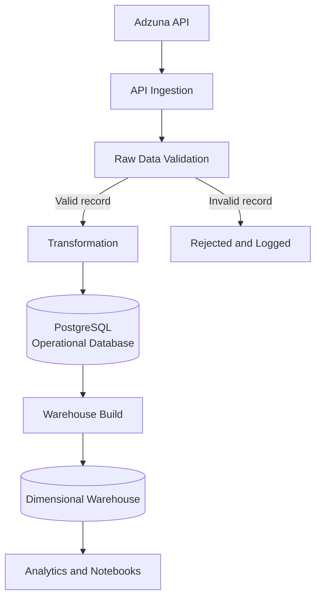
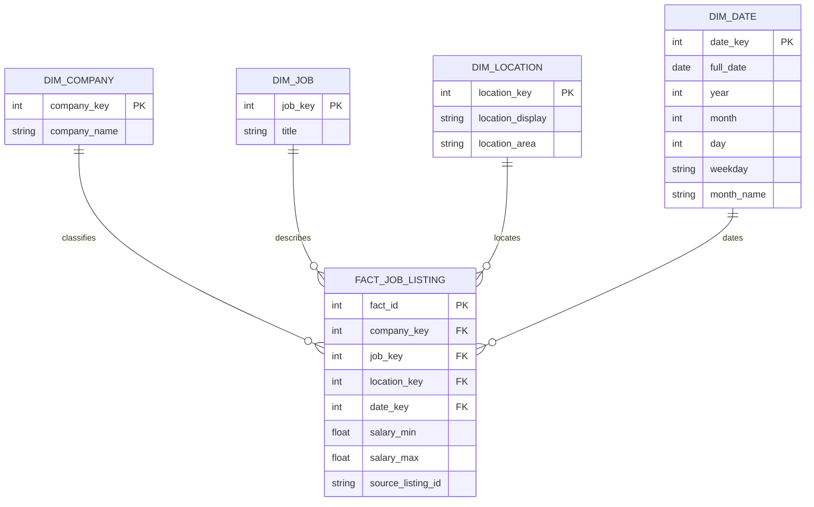

# Job Market Intelligence Platform

An end-to-end data engineering project that collects job listings from the Adzuna API, validates incoming data, stores operational records in PostgreSQL, builds a dimensional warehouse, and supports analytical exploration of the US data job market.

The project focuses on engineering practices as much as data analysis, emphasizing modular architecture, data quality, testing, and reproducible local development.

---

## Current Capabilities

- Extract job listings from the Adzuna API
- Validate raw source records before persistence
- Reject malformed or incomplete data without stopping the pipeline
- Store operational data in PostgreSQL
- Prevent duplicate ingestion using source business keys
- Build a dimensional warehouse (star schema)
- Perform exploratory analysis with Jupyter Notebook
- Execute automated tests with pytest
- Run continuous integration through GitHub Actions

---

## Current Engineering Practices

- Modular project structure
- Configuration through environment variables
- SQLAlchemy ORM
- Dockerized PostgreSQL development environment
- Business-rule validation layer
- Idempotent ingestion
- Structured logging
- Unit and pipeline tests
- Engineering documentation
- Architecture decision records (ADR)

---

## Architecture



Raw API records are validated before transformation and persistence. Invalid records are rejected and logged without stopping the ingestion of valid records.

The operational database is the source of truth, while warehouse construction runs as a separate process.

---

## Warehouse Model



The warehouse uses a star schema centered on one fact row per unique Adzuna job listing.

---

## Repository Structure

```text
job-market-intelligence-platform/

├── analytics/
├── config/
├── db/
├── docs/
├── ingestion/
├── notebooks/
├── processing/
├── tests/
├── warehouse/
│
├── logger.py
├── pipeline.py
├── requirements.txt
├── requirements-dev.txt
├── docker-compose.yml
└── README.md
```

---

## Technology Stack

| Area | Technology |
|------|------------|
| Language | Python |
| Database | PostgreSQL |
| ORM | SQLAlchemy |
| Testing | pytest, pytest-mock |
| Containerization | Docker |
| Notebook | Jupyter |
| Version Control | Git |
| CI | GitHub Actions |

---

# Quick Start

## 1. Clone the repository

```bash
git clone https://github.com/FrancoFM93/job-market-intelligence-platform.git
cd job-market-intelligence-platform
```

---

## 2. Create a virtual environment

```bash
python -m venv venv
```

Windows

```bash
venv\Scripts\activate
```

Linux / macOS

```bash
source venv/bin/activate
```

---

## 3. Install dependencies

Runtime

```bash
pip install -r requirements.txt
```

Development

```bash
pip install -r requirements-dev.txt
```

---

## 4. Configure environment variables

Create a `.env` file using `.env.example`.

Required variables include:

```text
ADZUNA_APP_ID
ADZUNA_APP_KEY

DB_HOST
DB_PORT
DB_NAME
DB_USER
DB_PASSWORD
```

---

## 5. Start PostgreSQL

```bash
docker compose up -d
```

---

## 6. Run the ingestion pipeline

```bash
py pipeline.py
```

The pipeline will:

- Fetch job listings
- Validate each source record
- Reject invalid records
- Insert new listings
- Skip duplicates
- Report execution statistics

---

## 7. Build the warehouse

```bash
py -m warehouse.build_warehouse
```

Warehouse construction is currently executed separately from ingestion.

---

# Testing

Run the complete test suite:

```bash
py -m pytest -q -p no:cacheprovider
```

Current status:

- 59 automated tests
- Validation tests
- Transformation tests
- API client tests
- Database model tests
- Pipeline behavior tests

---

# Documentation

| Document | Purpose |
|----------|---------|
| [Engineering Guide](docs/engineering-guide.md) | Development workflow, commands, and repository usage |
| [Engineering Walkthrough](docs/engineering-walkthrough.md) | Architecture and engineering decisions |
| [Architecture Decision Records](docs/decisions/) | Important technical decisions |

---

# Roadmap

Current priorities include:

- Expand validation rules
- Warehouse idempotency
- PostgreSQL integration tests
- Analytical SQL layer
- Data quality reporting
- AWS deployment
- Pipeline scheduling
- Infrastructure as Code

---

# License

This project is licensed under the MIT License.

---

# Author

FrancoFM93

